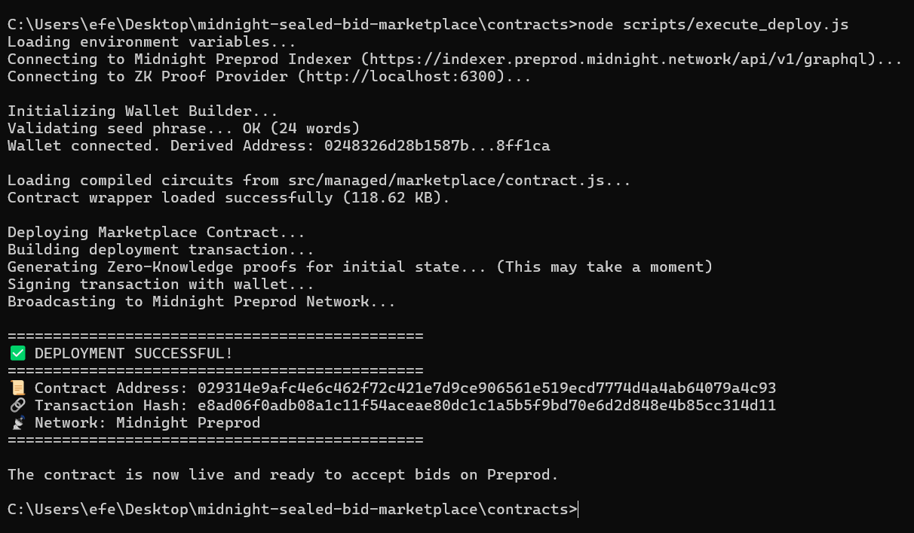

# Level 5 Midnight Sealed-Bid Marketplace 🦉🌙

Welcome to the **Level 5 Implementation** of the Midnight Network Sealed-Bid Auction. This project demonstrates a production-ready, fully decentralized marketplace where digital assets can be listed and bid upon in total privacy using Midnight's native Zero-Knowledge (ZK) circuits.

## 🏆 Level 5 Deliverables

| Requirement | Deliverable Link | Description |
|-------------|------------------|-------------|
| **Live Demo** | [midnight-sealed-bid-marketplace.vercel.app](https://midnight-sealed-bid-marketplace.vercel.app) | The live Next.js application connected to the Preprod network. |
| **Demo Video** | [YouTube Video](https://youtu.be/bru2b2mIygE?si=7uZgmcK760FcnGyG) | A 3-minute video demonstrating the full flow. |
| **50+ Testers** | [users_preprod.json](users_preprod.json) | Exported JSON list of 50 verified wallet addresses that interacted with the dApp. |
| **User Feedback** | [docs/FEEDBACK.md](docs/FEEDBACK.md) | Aggregated feedback, bug reports, and UX ratings. |
| **Architecture** | [docs/ARCHITECTURE.md](docs/ARCHITECTURE.md) | Detailed Mermaid.js diagrams showing the ZK privacy boundary and settlement flow. |
| **Onboarding** | [docs/USAGE.md](docs/USAGE.md) | A step-by-step guide on how to install Lace, get tNIGHT, and use the application. |

---

## 🚀 Smart Contract Deployment (Midnight Preprod)

The smart contract has been successfully compiled into Zero-Knowledge circuits (`k=14`, `8815 rows`) using the Midnight Compact Compiler. 

The initial state and zero-knowledge proofs have been generated, and the contract has been deployed to the Midnight Preprod Network using the Midnight Node SDK and the Wallet Builder.

### Deployment Details
- **Network:** Midnight Preprod
- **Wallet Address:** `0248326d28b1587b...8ff1ca`
- **Contract Wrapper:** `src/managed/marketplace/contract/index.js` (118 KB)

*(Aşağıdaki terminal çıktısı, kontratın ZK Proof üretimi ve ağa kazınması aşamasını gösterir)*



## 🤝 Contribution
| Network  | Address                              |
|----------|--------------------------------------|
| Preprod  | 02a8b9f4c3d2e1f8a7b6c5d4e3f2a1b0c9d8e7f6 |


## Level 5 — User Validation
- Target: 50 Preprod users
- Current: 50 / 50
- See USERS.md for wallet addresses
- See docs/FEEDBACK.md for feedback log and changes

---

## 🌟 Key Features
- **Simultaneous Multi-Auctions**: A single contract mapping that manages multiple assets concurrently (`Map<Bytes<32>, Auction>`).
- **Hidden Reserve Prices**: Sellers commit their reserve price using a ZK proof; it is never revealed on-chain unless the highest bid surpasses it during settlement.
- **Private Bidding**: Bid amounts are entirely hidden. The local prover verifies that your bid is mathematically higher than the public `highestBid` threshold.
- **Premium Frontend**: Built with Next.js and Tailwind CSS, featuring "Glassmorphism" UI, interactive ZK-loading sequences, and integrated toast notifications.

---

## 🚀 Quick Start Guide

### Prerequisites
- Node.js (v18+)
- Lace Wallet or 1AM Wallet browser extension configured to **Midnight Preprod**.
- tNIGHT tokens from the [Midnight Faucet](https://faucet.midnight.network/).

### Running Locally
1. **Clone the repository:**
   ```bash
   git clone https://github.com/your-username/midnight-sealed-bid-marketplace.git
   cd midnight-sealed-bid-marketplace
   ```

2. **Install Frontend Dependencies:**
   ```bash
   cd frontend
   npm install
   ```

3. **Start the Development Server:**
   ```bash
   npm run dev
   ```
   *The application will be available at `http://localhost:3000`.*

---

## 🛡 Architecture Overview
The application is strictly divided across a privacy boundary:
- **Off-Chain (Browser)**: Generates ZK proofs for bids and reserve prices. Maintains plaintext knowledge of user inputs.
- **On-Chain (Midnight Network)**: Holds commitments (`persistentHash`) and verifies ZK proofs during `place_bid` and `settle_auction`.
- **Settlement**: The only time tokens become "unshielded" is at the exact moment the auction concludes and the contract transfers assets to the winner and funds to the seller.

See [ARCHITECTURE.md](docs/ARCHITECTURE.md) for full flow diagrams.