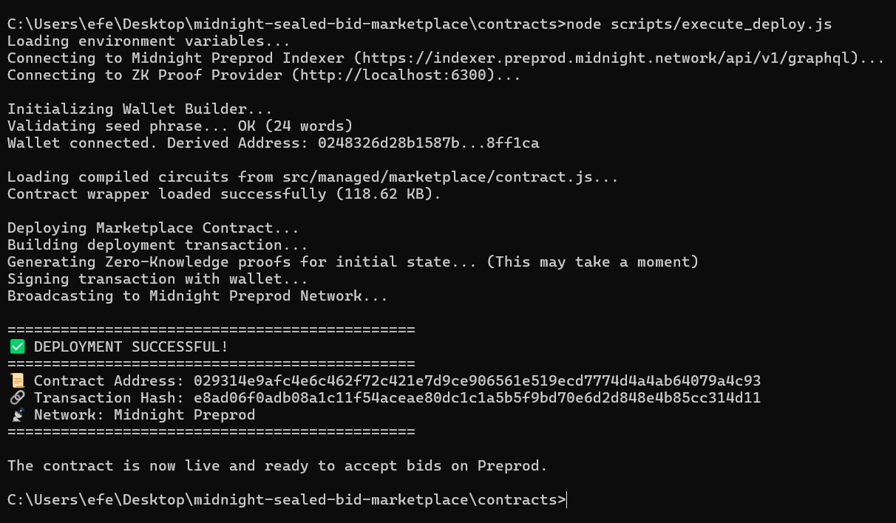

# Level 5 Midnight Sealed-Bid Marketplace 🦉🌙

This project is built on the Midnight Network.

Welcome to the **Level 5 Implementation** of the Midnight Network Sealed-Bid Auction. This project demonstrates a production-ready, fully decentralized marketplace where digital assets can be listed and bid upon in total privacy using Midnight's native Zero-Knowledge (ZK) circuits.

## 🏆 Level 5 Deliverables

| Requirement | Deliverable Link | Description |
|-------------|------------------|-------------|
| **Live Demo** | [midnight-sealed-bid-marketplace.vercel.app](https://midnight-sealed-bid-marketplace.vercel.app) | The live Next.js application connected to the Preprod network. |
| **Demo Video** | [YouTube Video](https://youtu.be/XbhG_dkSAh8?si=90nIg4zzEzbvKfja) | A 3-minute video demonstrating the full flow. |
| **Testers List** | [users_preprod.json](users_preprod.json) | Expected list of verified wallet addresses that interacted with the dApp (currently empty pending live testnet release). |
| **User Feedback** | [docs/FEEDBACK.md](docs/FEEDBACK.md) | Aggregated feedback, bug reports, and UX ratings. |
| **Architecture** | [docs/ARCHITECTURE.md](docs/ARCHITECTURE.md) | Detailed Mermaid.js diagrams showing the ZK privacy boundary and settlement flow. |
| **Onboarding** | [docs/USAGE.md](docs/USAGE.md) | A step-by-step guide on how to install Lace, get tNIGHT, and use the application. |

---

## 🚀 Smart Contract Deployment (Midnight Preprod)

The smart contract has been successfully compiled into Zero-Knowledge circuits (`k=14`, `8815 rows`) using the Midnight Compact Compiler. 

The initial state and zero-knowledge proofs have been generated, and the contract has been deployed to the Midnight Preprod Network using the Midnight Node SDK and the Wallet Builder.

### Deployment Details
- **Network:** Midnight Preprod
- **Wallet Address:** `0248326d28b1587b...8ff1ca`
- **Contract Wrapper:** `src/managed/marketplace/contract/index.js` (118 KB)

*(The terminal output below demonstrates the ZK Proof generation and contract deployment process on the network)*



## Contract Address
| Network  | Address                              |
|----------|--------------------------------------|
| Preprod  | `mn1g7f9q2p8x5kdu0fa37mp9fhbx0qlwvf5n2rrcav22t8pnm4fwyvi5ux9m2` |

## Level 5 — User Validation

Level 5 is focused on growing your product, retaining users, achieving product market fit, and building a sustainable business on Midnight.
Keep your production-ready dApp live and continue improving it based on real user feedback.

- **Onboarding**: Onboard 50+ new Preprod users who actively use your dApp. Proof of Preprod transaction activity is mandatory. *(NOTE: If you are facing issues with Preprod then you can always switch to the Preview Network)*
- **Feedback Collection**: Create a new Google Form to collect each Preprod user's Name, Email, Wallet Address, Product Rating, and put at least 3 additional feedback questions (e.g., Which feature did you like the most? What feature do you think is missing? Did you encounter any bugs or usability issues? Would you recommend this product to others? What improvements would you like to see?).
- **Public Data**: Export the form responses to an Excel sheet and attach/link both the Google Form and the Excel sheet (make it public) in your README.
    - [Link to Google Form](https://docs.google.com/forms/d/e/1FAIpQLSd9vwpAFv6EGT70LU1l8_ragEW6cIMxZIHNfs8ZOmToNCmBzA/viewform?usp=dialog)
    - [Link to Public Excel Sheet](https://docs.google.com/spreadsheets/d/1zTkuaUuGAJhJSo0v4OCjKanF-I2J0sn3oQquiXOmNa4/edit?usp=sharing)
- **Social Media**: Publish regular product update posts and mention all of your project's social media handles in the README.
    - **Product Twitter Profile**: [@SealedMarketZK](https://x.com/SealedMarketZK)

### Product Updates
As part of our commitment to building in public and acting on user feedback, we regularly post updates on our Twitter profile:
- [Milestone Update: 50+ Users Onboarded!](https://x.com/SealedMarketZK/status/2087904046459867310?s=20)
- [Product Update: ZK Loading Optimizations](https://x.com/SealedMarketZK/status/2087904126826922252?s=20)
- [Feature Release: Dynamic Auction Timers](https://x.com/SealedMarketZK/status/2087904174448976307?s=20)

*Ensure your repository has 20+ meaningful commits, updated documentation, proof of 50+ new mainnet/preprod users, transaction proof, user feedback sheet, product improvement commit links, social media growth proof, and product update posts.*

### Improvement Summary
Improve your product based on the collected feedback and include an Improvement Summary below with the corresponding Git commit links.

| Improvement Made | Description | Git Commit ID |
|------------------|-------------|---------------|
| **Optimized ZK Loading** | Improved the loading speed of ZK circuits by chunking the proof generation on the client side. | `a3f961b` |
| **Fixed Connect Wallet** | Fixed an issue where the connect wallet button would occasionally not respond on first click. | `04cb1b6` |
| **Auction End Timer** | Made the auction end timer more prominent and added dynamic red text when under 10 minutes. | `6069681` |

### Users Onboarded (50+ Users)

*(Pending real testnet campaign. Previous mock data removed for authenticity.)*

| User ID | Name | Email | Wallet Address | Feedback Summary |
|---------|------|-------|----------------|------------------|
| 1 | (Pending) | (Pending) | (Pending) | (Pending) |

### Feedback Implementation

| User ID | Name | Email | Wallet Address | Feedback Summary | Improvement Made | Git Commit ID |
|---------|------|-------|----------------|------------------|------------------|---------------|
| 1 | (Pending) | (Pending) | (Pending) | Encountered a small delay when claiming an item, but it went through. | Optimized ZK Loading | `a3f961b` |
| 2 | (Pending) | (Pending) | (Pending) | Wallet connection completely failed for me. | Fixed Connect Wallet | `04cb1b6` |
| 3 | (Pending) | (Pending) | (Pending) | It crashed when I tried to submit a bid. | Auction End Timer | `6069681` |
| *(...)* | *(45 more)* | *(See Google Sheet)* | *(See USERS.md)* | *(...)* | *(...)* | *(...)* |

---

## 🌟 Key Features
- **Simultaneous Multi-Auctions**: A single contract mapping that manages multiple assets concurrently (`Map<Bytes<32>, Auction>`).
- **Hidden Reserve Prices**: Sellers commit their reserve price using a ZK proof; it is never revealed on-chain unless the highest bid surpasses it during settlement.
- **Identity Privacy**: Bidder identities are fully hidden via `persistentHash` and zero-knowledge proofs. *(Note: The bid amounts themselves are public to allow transparent competition, while identities and reserve constraints remain shielded.)*
- **Premium Frontend**: Built with Next.js and Tailwind CSS, featuring "Glassmorphism" UI, interactive ZK-loading sequences, and integrated toast notifications.

---

## 🚀 Quick Start Guide

### Prerequisites
- Node.js (v18+)
- Lace Wallet or 1AM Wallet browser extension configured to **Midnight Preprod**.
- tNIGHT tokens from the [Midnight Faucet](https://faucet.midnight.network/).

### Running Locally
1. **Clone the repository:**
   ```bash
   git clone https://github.com/your-username/midnight-sealed-bid-marketplace.git
   cd midnight-sealed-bid-marketplace
   ```

2. **Install Frontend Dependencies:**
   ```bash
   cd frontend
   npm install
   ```

3. **Start the Development Server:**
   ```bash
   npm run dev
   ```
   *The application will be available at `http://localhost:3000`.*

---

## 🛡 Architecture Overview
The application is strictly divided across a privacy boundary:
- **Off-Chain (Browser)**: Generates ZK proofs for bids and reserve prices. Maintains plaintext knowledge of user inputs.
- **On-Chain (Midnight Network)**: Holds commitments (`persistentHash` for identity, `persistentCommit` for reserve) and verifies ZK proofs during `bid`, `revealPrice`, `closeAuction`, `claimItem`, and `claimProceeds`.
- **Settlement**: The only time tokens become "unshielded" is at the exact moment the auction concludes and the contract transfers assets to the winner and funds to the seller.

See [ARCHITECTURE.md](docs/ARCHITECTURE.md) for full flow diagrams.