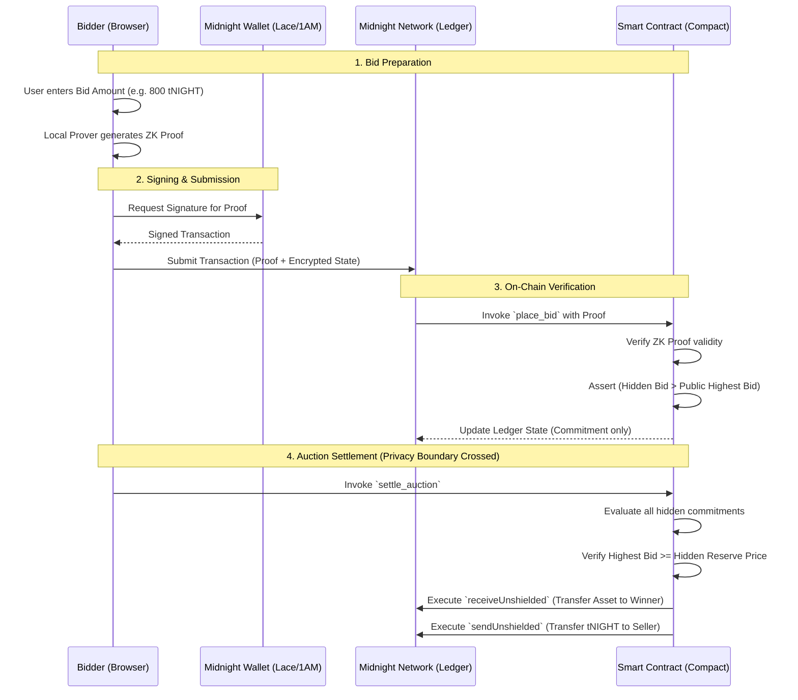

# Architecture: Level 5 Sealed-Bid Marketplace

This document outlines the architectural flow and privacy boundaries of the Midnight Sealed-Bid Marketplace.

## Overview
The marketplace utilizes Midnight's **Compact** language to compile Zero-Knowledge (ZK) circuits. These circuits ensure that sensitive data—specifically bidder identities, bid amounts, and seller reserve prices—never leak on-chain in plaintext.

## Privacy Boundary & Zero-Knowledge Workflow

The core innovation is maintaining a strict privacy boundary until the exact moment of auction settlement.

### Key Components
1. **Frontend (Next.js)**: Handles UI, wallet connection (`lib/midnight.ts`), and invokes the local prover.
2. **Local Prover (WASM)**: The browser downloads the compiled ZK circuits and runs them locally. It generates a proof that a bid is valid without exposing the input integers.
3. **Ledger State (Map)**: The smart contract maintains a `Map<Bytes<32>, Auction>` to handle multiple simultaneous auctions.
4. **Privacy Boundary**: Bid amounts remain as `persistentHash` commitments. They are only "unshielded" during the final settlement transaction when ownership changes hands.
